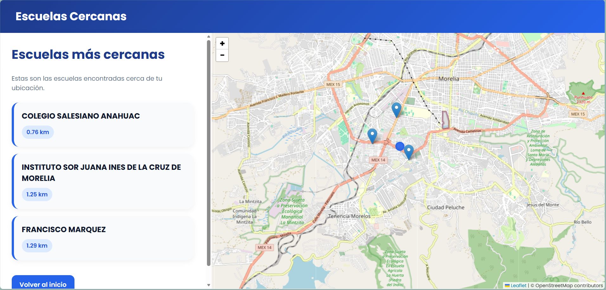

# infoEscuelasMX

**infoEscuelasMX** es un proyecto desarrollado por estudiantes de la ENES Morelia cuyo objetivo es facilitar la búsqueda de instituciones educativas cercanas a la ubicación del usuario. La plataforma permite localizar preescolares, primarias y secundarias mediante un sistema de geolocalización y visualización en mapa, ofreciendo una experiencia rápida, intuitiva y accesible.

El proyecto busca apoyar a estudiantes, padres de familia y usuarios en general al momento de encontrar opciones educativas próximas a su ubicación, integrando herramientas web modernas para mostrar información organizada y resultados de manera visual e interactiva.
---
## Integrantes:

* **Ingeniería de Tecnología:** Kasandra Cortizo
* **Testing:** Carlos Montoya
* **Líder de Proyecto:** Tonatiuh L. Martínez
---

## Objetivo General

El objetivo de **infoEscuelasMX** consiste en proporcionar a padres de familia una forma rapida de acceder a las preescolare, primarias y secundarias mas sercanas a la ubicacion de los interesados.
---

## Objetivos particulares

---
## Tecnologias usadas

### Backend
* Python3
* Django

### Frontend
* HTML
* JavaScript
* CSS
* Leaflet

---
## Arquitectura

Se uso una base de datos de la SEP (Secretaria de Educacion Publica) 

* Base de datos usada: https://www.datos.gob.mx/dataset/catalogo_centros_trabajo_sep/resource/3457e135-e83c-43d3-b721-f7fb93c5280c
