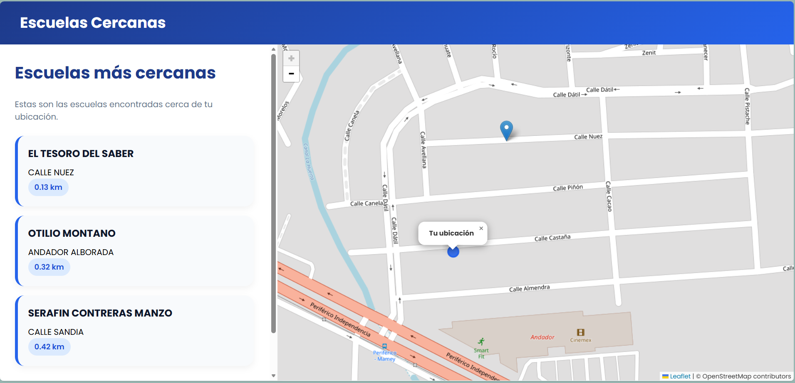
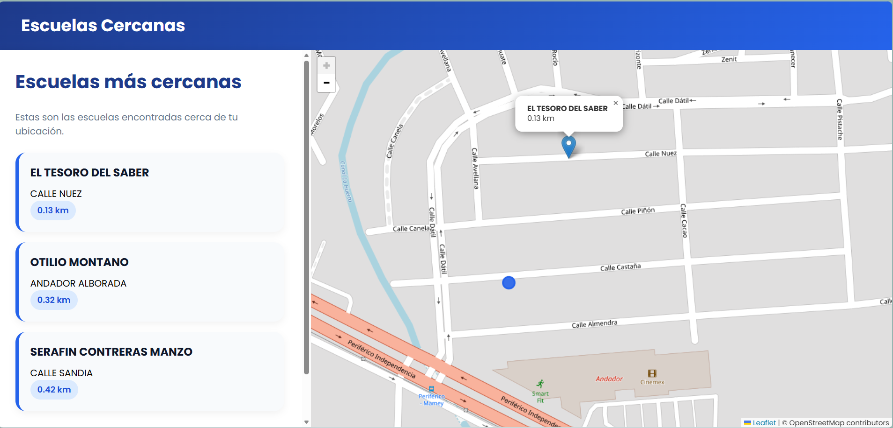

# infoEscuelasMX

infoEscuelasMX is a project developed by students from ENES Morelia with the purpose of facilitating the search for educational institutions located near the user's location. Geolocation and map visualization tools are integrated into the platform to enable the fast and accurate location of preschool, elementary, and middle schools.

Through an intuitive, accessible, and user-friendly interface, educational options available in the surrounding area can be consulted, their locations can be identified, and relevant information can be obtained to support decision-making. In this way, the process of searching for educational institutions is simplified, and a technological solution is provided to bring families closer to the most suitable educational alternatives for their children.

## Team Members:

* Technology Engineering: Kasandra Cortizo
* Testing: Carlos Montoya
* Project Leader: Tonatiuh L. Martínez

## Technologies Used:

### Backend
* Python3
* Django

### Frontend
* HTML
* JavaScript
* CSS
* Leaflet (https://leafletjs.com/)

### Data Source
* Database from the Educational Centers Catalog of the Secretaría de Educación Pública (SEP): https://www.datos.gob.mx/dataset/catalogo_centros_trabajo_sep/resource/3457e135-e83c-43d3-b721-f7fb93c5280c
---
## Arquitecture

A database provided by the SEP (Public Education Secretariat) was used, from which information regarding the names and locations of educational institutions was obtained.

Through a form, the following parameters are requested from the user: the number of schools to be displayed and the desired educational level (preschool, elementary school, or middle school). In addition, permission to access the user's geographic location is requested, allowing distances between the user and the registered schools to be calculated using a radial proximity criterion.

As a result, a list of educational institutions is displayed, including the name and street address of each school. Furthermore, an interactive map is presented in which the user's location is represented by a Circle Marker, while schools are represented by Marker pins, facilitating the visual identification of nearby educational options.

 

## Installation and Execution

1. The repository should be cloned:
   git clone https://github.com/Narhada/infoEscuelasMX.git

2. A virtual environment should be created:
   python -m venv venv

3. The virtual environment should be activated:
   source venv/bin/activate

4. The project dependencies should be installed:
   pip install -r requirements.txt

5. The database username and password should be updated in the views.py file.
   The server should be started:

6. python manage.py runserver
